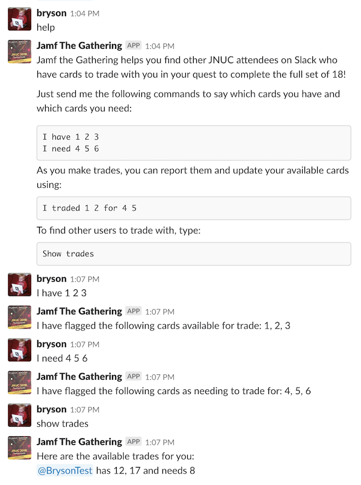
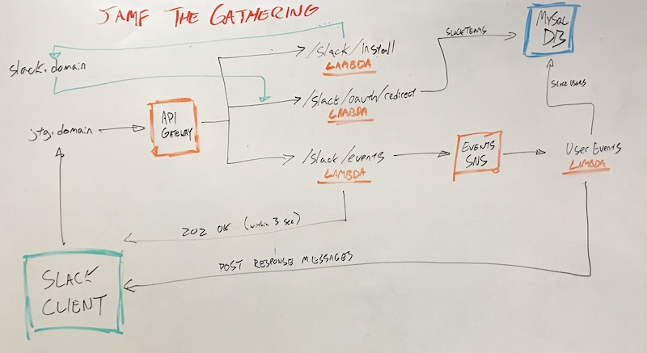

# Jamf The Gathering

A trading card assistant for JNUC 2018.

At JNUC this year, Jamf gave out trading cards of employees and products as a bit of a social game. If youn wanted to get all the cards you would need to trade with others.

One person in the [#jnuc](https://macadmins.slack.com/messages/C0A204C15) channel on the MacAdmins Slack had a great idea:

> Ok, so who is building a trading portal at the hackathon?

So that happened. Jamf The Gathering is a serverless Slack Bot that helps JNUC attendees find others to trade their swag cards with to complete the full set of 18.

## Jamf The Gathering in action

## Whiteboard Architecture

